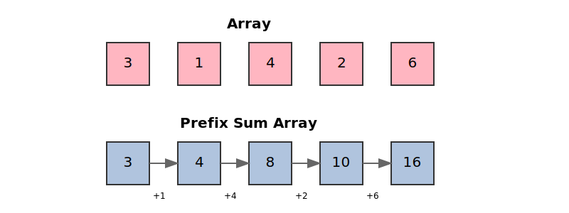
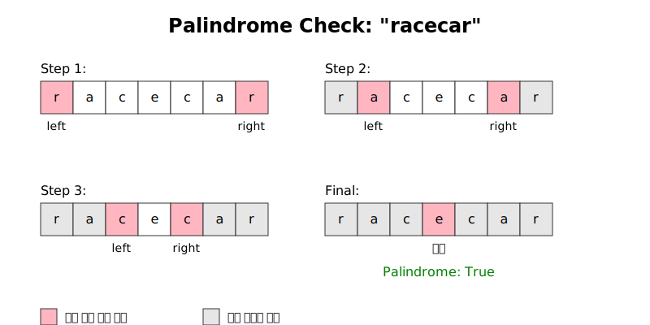
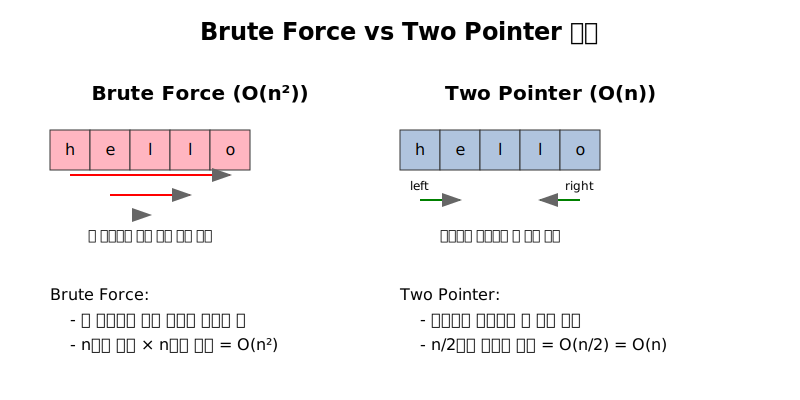

알겠습니다. LeetCode의 15가지 주요 패턴을 한글로 정리해드리겠습니다.

## 1. **Prefix Sum (접두사 합)**
부분 배열의 합을 빠르게 계산할 때 사용한다.

### 예시

배열 `[3, 1, 4, 2, 6]`가 주어졌다고 가정하자.



위 그림과 같이 `Prefix Sum Array`를 `P[i] = A[i] + A[i - 1] + ... + A[0]`을 만들어두자.
    
- `P` : Prefix Sum Array
- `A` : Array

그러면 인덱스 `i ~ j`까지의 부분합은 아래와 같이 구할 수 있다.

- `SUM[i, j] = P[j] - P[i] (when j > i)`

위처럼 계산할 경우, 부분합을 찾는 시간 복잡도는 `O(1)`이 된다

아래 python 코드와 같이 구현할 수 있다.

```python
def create_prefix_sum(arr):
    # prefix_arr의 0번 인덱스를 0으로 초기화
    prefix_sum = [0] * (len(arr) + 1)  
    for i in range(len(arr)):
        prefix_sum[i + 1] = prefix_sum[i] + arr[i]
    return prefix_sum

def get_range_sum(prefix_sum, left, right):
    return prefix_sum[right + 1] - prefix_sum[left]

# 사용 예시
arr = [3, 1, 4, 2, 6]
prefix_sum = create_prefix_sum(arr)

# 구간 [1,3] (인덱스 1부터 3까지)의 합을 구하는 경우
print(get_range_sum(prefix_sum, 1, 3))  # 출력: 7 (1 + 4 + 2)
```

## 2. **Two Pointers (투 포인터)**
배열이나 문자열을 양쪽에서 탐색할 때 사용
  
### 예시
양 끝에서 시작해 중앙으로 이동하며 비교하여 문자가 회문(palindrome)인지 판별할 수 있다.



아래는 `two pointers`를 활용하여 회문을 검사하는 `python` 코드이다.

```python
def is_palindrome(s: str) -> bool:
    # 문자열의 양 끝에서 시작하는 포인터
    left, right = 0, len(s) - 1
    
    while left < right:
        # 양쪽 문자가 다르면 회문이 아님
        if s[left] != s[right]:
            return False
        # 포인터를 중앙으로 이동
        left += 1
        right -= 1
    
    return True

# 테스트
print(is_palindrome("racecar"))  # True
print(is_palindrome("hello"))    # False
```

### 시간 복잡도

만약 아래처럼 코드를 작성한다면 `O(n^2)`만큼 시간을 소비한다.

```python
def is_palindrome_bruteforce(s: str) -> bool:
    n = len(s)
    # 각 문자마다 대칭되는 위치의 문자를 찾아 비교
    for i in range(n):
        # 각 i마다 대칭 위치 (n-1-i) 찾기
        if s[i] != s[n-1-i]:
            return False
    return True
```



## 3. **Sliding Window (슬라이딩 윈도우)**

연속된 구간을 탐색할 때 사용한다.

### 예시

크기가 K인 연속 부분 배열의 최대 합 찾기

4. **Fast and Slow Pointers (빠른/느린 포인터)**
   - 용도: 연결 리스트의 순환 감지나 중간 지점 찾기
   - 예시: 연결 리스트에서 순환 구조 찾기 - 토끼와 거북이 알고리즘

5. **Linked List In-place Reversal (연결 리스트 제자리 뒤집기)**
   - 용도: 추가 공간 없이 연결 리스트 조작
   - 예시: 연결 리스트를 거꾸로 뒤집기

6. **Monotonic Stack (단조 스택)**
   - 용도: 다음으로 큰/작은 원소 찾기
   - 예시: 배열에서 각 원소의 다음으로 큰 수 찾기

7. **Top K Elements (상위 K 원소)**
   - 용도: K개의 최대/최소 원소 찾기
   - 예시: 배열에서 세 번째로 큰 수 찾기 (힙 사용)

8. **Overlapping Intervals (겹치는 구간)**
   - 용도: 구간이 겹치는 문제 해결
   - 예시: 겹치는 회의 시간 병합하기

9. **Modified Binary Search (변형된 이진 탐색)**
   - 용도: 완벽히 정렬되지 않은 배열에서의 탐색
   - 예시: 회전된 정렬 배열에서 원소 찾기

10. **Binary Tree Traversal (이진 트리 순회)**
    - 용도: 트리 구조 탐색
    - 예시: 전위/중위/후위/레벨 순회

11. **Depth First Search (깊이 우선 탐색)**
    - 용도: 그래프나 트리의 모든 경로 탐색
    - 예시: 두 노드 사이의 경로 찾기

12. **Breadth First Search (너비 우선 탐색)**
    - 용도: 레벨 단위 탐색
    - 예시: 최단 경로 찾기

13. **Matrix Traversal (행렬 순회)**
    - 용도: 2차원 배열 문제 해결
    - 예시: 섬의 개수 세기 문제

14. **Backtracking (백트래킹)**
    - 용도: 가능한 모든 해결책 탐색
    - 예시: N-Queens 문제, 스도쿠 풀기

15. **Dynamic Programming (동적 계획법)**
    - 용도: 최적화 문제 해결
    - 예시: 최장 증가 수열, 배낭 문제

이러한 패턴들은 코딩 인터뷰에서 자주 출제되며, Amazon이나 Google같은 기업의 면접에서도 자주 등장한다고 합니다. 각 패턴을 잘 이해하고 연습하면 새로운 문제를 마주했을 때도 빠르게 해결 방법을 떠올릴 수 있습니다.